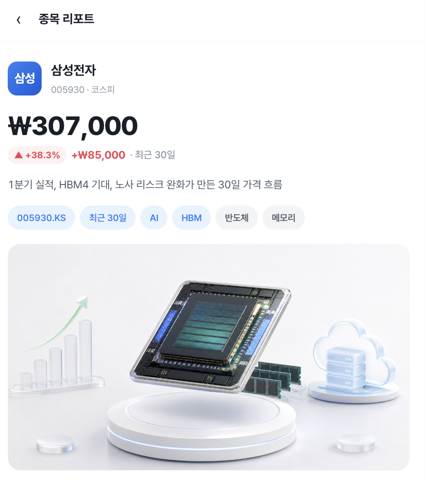

# 주식 리포트 하네스

<p align="center">
  
</p>

자연어 한 줄이면 Toss 스타일 종목 리포트가 나옵니다.

```
/stock-goal 삼성전자 1년 분석
```

Claude Code를 열고 위 명령을 입력하면, 계획 → 리서치 → 원고 → 히어로 이미지 → 4-way 리뷰 → 빌드까지 자동으로 진행되어 검증된 HTML 리포트가 생성됩니다.

`plan/<slug>.md`가 후속 단계의 단일 기준 문서이며, 모든 산출물은 같은 `slug`의 선행 파일을 참조합니다.

## 파이프라인

```text
/stock-plan <요청>      → plan/<slug>.md
/stock-research <slug> → research/<slug>.md + 원자료 JSON
/stock-draft <slug>    → drafts/<slug>.md
/stock-image <slug>    → hero 후보 3개 + selected-image.json
/stock-review <slug>   → reviews/<slug>.md
/stock-build <slug>    → scripts/build_report.py가 output/<slug>.html + price-chart JSON 생성
```

빌드는 `review status: pass`, 선택된 hero 이미지, yfinance 가격 차트, frontmatter/섹션 정합성을
`scripts/validate_report_contract.py`로 모두 통과해야 성공합니다.

### End-to-end skill: `stock-goal`

단계별 명령 대신 Claude Code의 `stock-goal` skill을 사용하면 자연어 요청 하나로 전체 파이프라인을 순차 실행합니다.

```text
stock-goal: 삼성전자 최근 30일 분석 리포트 생성
→ plan → research → draft → image → review → build
→ output/<slug>.html
```

`stock-goal`은 각 `/stock-*` 단계의 계약을 그대로 따릅니다. 선행 산출물이 없으면 먼저 만들고, review가 `needs_fix`이면 수정 후 재리뷰 루프를 돌며, 동일 차단 이슈가 반복되면 `blocked`로 멈춥니다. 최종 보고에는 생성 산출물 목록, HTML 경로, 프리뷰 URL, 파이프라인 중 발생한 이슈가 포함됩니다.

## 주요 디렉터리

```text
.claude/commands/      slash command 정의
.claude/skills/        단계별/엔드투엔드 실행 계약
.claude/agents/        review용 subagent
.claude/hooks/         Claude Code 훅 기반 가드레일
plan/                  계획서
research/              리서치 결과
drafts/                원고
reviews/               4-way 리뷰
output/                최종 HTML 및 assets
docs/                  스타일·출력·이미지 명세
design/                최종 HTML 렌더링 디자인 계약
scripts/               보조/검증 스크립트
server.js              output 미리보기 서버
```

## 디자인 문서 로직

- 리포트 UI의 기준 문서는 `design/toss_design.md`입니다. 색상, 타이포그래피, 간격, 컴포넌트, 차트 스타일, 한국 주식 색상 규칙(상승=빨강, 하락=파랑)을 정의합니다.
- `scripts/build_report.py`는 이 디자인 문서를 코드로 옮긴 deterministic renderer입니다. build 단계에서 새 디자인 판단을 즉흥적으로 추가하지 않고, draft/research 내용을 승인된 시각 규칙으로만 렌더링합니다.
- 디자인 변경 순서는 `design/toss_design.md` 갱신 → `scripts/build_report.py` 반영 → 필요 시 `sample/skhynix.html`/`docs/output-spec.md` 동기화 → `npm run check` 및 리포트 build/validate입니다.
- `sample/skhynix.html`은 참고 composition입니다. 문서와 예시가 충돌하면 `design/toss_design.md`를 우선합니다.
- review의 `report-designer` 관점은 생성 HTML이 디자인 문서의 모바일 shell, hero 이미지 배치, price chart 스타일, References/footnote 배치 원칙을 지키는지 확인합니다.

## 단계별 핵심 계약

### Plan

- 필수 출력: `plan/<slug>.md`
- 필수 frontmatter: `slug`, `topic`, `request`, `output_type`, `audience`, `ticker`, `period_start`, `period_end`, `chart_required`, `price_data_source`, `price_data_interval`, `created_at`, `assumptions`
- 기간이 없으면 최근 6개월을 기본값으로 두고 `assumptions`에 기록합니다.

### Research

- plan의 `ticker`, `period_start`, `period_end`를 기준으로 작성합니다.
- 가격 데이터 요구는 yfinance 일봉(`interval=1d`)입니다.
- 종목 관련 요청은 최신 뉴스 최소 100건을 수집·분류·분석합니다.
- 기사 원문 URL이 없으면 조작하지 않고 fallback 여부를 표시합니다.

### Draft

- 필수 출력: `drafts/<slug>.md`
- plan과 research를 근거로 작성하고 `plan_source`, `research_source`를 남깁니다.
- H1은 정확히 1개입니다.
- 필수 섹션: `## 개요`, `## 배경`, `## 메커니즘`, `## 영향과 적용`, `## References`
- 가격 차트는 데이터 배열 대신 `price-chart` 블록으로 선언합니다.
- 투자 권유, 수익 보장, 매매 지시 표현은 금지합니다.

### Image

- `python3 scripts/run_stock_image_codex.py <slug>`가 Codex CLI를 열어 `imagegen` skill / built-in `image_gen`으로 hero 후보 3개를 만들고 평가·선택 기록을 남깁니다.
- 필수 출력: `output/assets/<slug>-hero-v1~v3.*`, score JSON, image manifest, `selected-image.json`
- 이미지에는 텍스트, 숫자, 티커, 로고, 워터마크, UI 스크린샷을 넣지 않습니다.
- image manifest는 `status: complete`, `generation_method: codex-cli-imagegen`, `generated_with`를 포함해야 하며, procedural/Pillow/SVG/placeholder 방식은 build 검증에서 실패합니다.
- `selected-image.json`은 최소 `slug`, `selected_candidate`, `image_path` 또는 `selected_image`, `reason`, `generated_with`를 포함합니다. 경로는 `assets/<file>.png` 또는 `output/assets/<file>.png`처럼 resolver가 찾을 수 있는 값으로 둡니다.
- 이미지 생성 도구가 없으면 prompt 파일과 blocked manifest만 남기고 build로 진행하지 않습니다.

`selected-image.json` 예시:

```json
{
  "slug": "<slug>",
  "selected_candidate": 2,
  "image_path": "assets/<slug>-hero-v2.png",
  "reason": "리포트 결론과 가장 잘 맞음",
  "generated_with": "Codex CLI $imagegen / built-in image_gen"
}
```

### Review

- 별도 관점의 4-way review를 수행합니다.
- 리뷰어: `fact-checker`, `report-designer`, `content-editor`, Codex independent review
- 필수 출력: `reviews/<slug>.md`
- `status`는 `pass | needs_fix | blocked` 중 하나입니다.
- 리뷰 작성 후 `python3 scripts/validate_report_contract.py <slug>`를 실행해 계약을 통과해야 합니다.
- `needs_fix`이면 선행 단계 수정 후 같은 slug로 다시 review합니다.

### Build

- 필수 입력: plan, research, draft, pass review, selected hero image
- 필수 출력: `output/<slug>.html`, `output/assets/<slug>-price-chart-v*.json`
- 빌드는 수동 HTML 작성이 아니라 `python3 scripts/build_report.py <slug>`로 수행합니다.
- 빌더는 yfinance 1일봉 가격 JSON을 생성/갱신하고, Markdown/frontmatter를 파싱해 HTML 템플릿을 렌더링합니다.
- HTML 템플릿은 `design/toss_design.md`의 Toss 스타일을 따르며, `sample/skhynix.html`은 참고용 예시입니다.
- 빌드 완료 후 `python3 scripts/validate_report_contract.py <slug> --require-html --require-price-chart`를 통과해야 합니다.
- 최종 HTML 본문에는 `[S1]`, `[N1]` 같은 검증용 인라인 표식을 남기지 않습니다.
- 하단에 투자 유의 문구를 포함합니다.

## 훅 기반 가드레일

이 저장소는 Claude Code 프로젝트 훅으로 반복 실패를 사전에 차단합니다. 훅 설정은 `.claude/settings.json`에 있으며, 각 스크립트는 `.claude/hooks/` 아래에서 단일 책임으로 동작합니다.

| 훅 | 이벤트 | 역할 |
| --- | --- | --- |
| `block-dangerous-bash.sh` | `PreToolUse(Bash)` | `rm -rf /`, `sudo`, `curl ... | sh`, `git push --force/-f` 등 되돌리기 어려운 명령 차단 |
| `protect-sensitive-files.sh` | `PreToolUse(Bash/Write/Edit/MultiEdit)` | `.env*`, `.git/`, `.github/workflows/`, `docs/finance-style-guide.md`, `docs/output-spec.md` 수정 차단 |
| `forbid-financial-advice.sh` | `PreToolUse`, `PostToolUse` | draft/HTML의 투자 권유, 수익 보장, FOMO 표현 차단 |
| `enforce-plan.sh` | `PreToolUse` | `plan → research → draft → image → review → build` 선행 산출물 순서 강제 |
| `enforce-citations.sh` | `PreToolUse`, `PostToolUse` | draft 숫자 주장에 `[S1]`, `[N1]`, `[P1]`류 출처 표식 요구 |
| `remind-review.sh` | `PostToolUse`, `Stop` | draft 변경 후 최신 4-way `pass` review가 없으면 세션 종료 차단 |
| `inject-memory-context.sh` | `UserPromptSubmit` | 요청 도메인에 맞는 memory topic 자동 주입 |
| `enforce-memory.sh` | `PostToolUse` | memory 파일 변경 후 `python3 scripts/validate_memory.py` 실행 |

주의: 이 훅들은 Claude Code 에이전트가 이 프로젝트 설정을 읽을 때 자동 적용됩니다. Codex/OMX 런타임의 별도 도구 호출에는 같은 `.claude/settings.json` 훅이 자동으로 걸리지 않으므로 별도 연결이 필요합니다.

## 보조 명령

초기 설치:

```bash
python3 -m venv .venv
. .venv/bin/activate
pip install -r requirements.txt
npm run check
```

계약 검증:

```bash
python3 scripts/validate_report_contract.py <slug>
python3 scripts/validate_report_contract.py <slug> --require-html --require-price-chart
```

deterministic build:

```bash
python3 scripts/build_report.py <slug>
```

이미지 단계:

```bash
python3 scripts/run_stock_image_codex.py <slug>
python3 scripts/run_stock_image_codex.py <slug> --dry-run  # Codex 프롬프트 확인용
```

최신 뉴스 5건 추출:

```bash
python3 scripts/news_latest5.py output/assets/<slug>-*-latest100.json --format markdown
```

메모리 검증:

```bash
python3 scripts/validate_memory.py
```

로컬 미리보기:

```bash
node server.js
# 콘솔에 최신 리포트 URL과 전체 HTML 리포트 목록이 표시됩니다.
# 예: Report URL: http://localhost:3000/samsung-electronics-recent-1y-2026-05.html
```

특정 리포트 링크를 우선 표시하려면 slug 또는 html 파일명을 넘깁니다.

```bash
node server.js samsung-electronics-recent-1y-2026-05
# Report URL: http://localhost:3000/samsung-electronics-recent-1y-2026-05.html
```

## 의존 도구
- Python 3.11+, `requirements.txt`의 yfinance/Markdown/PyYAML, Node.js 18+, Claude/Codex CLI
- 선택 도구: jq(수동 JSON 점검용)
- Node 미리보기/검증 스크립트: `npm run check`, `npm run test`, `npm start -- <slug>`
